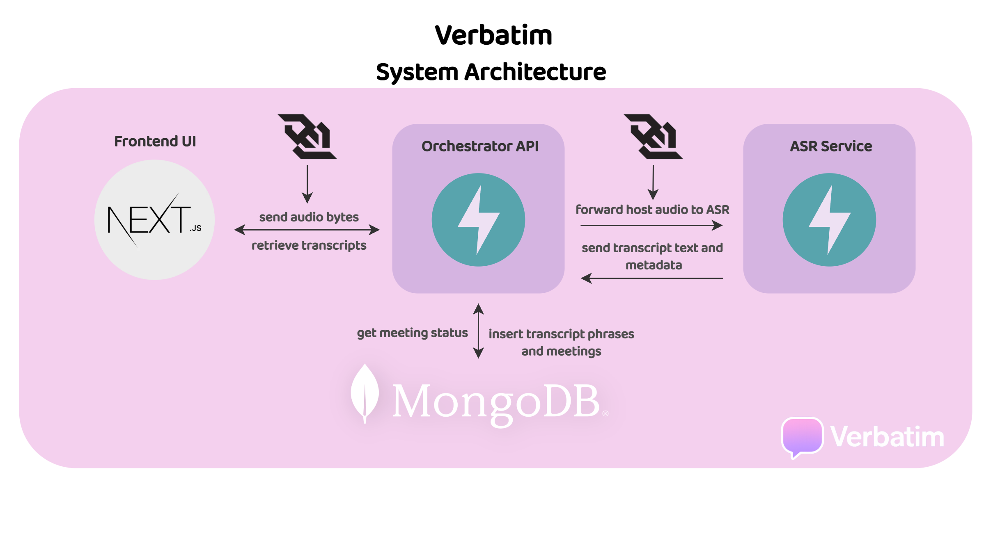

# Verbatim - Real‑Time Transcription

## Overview
**Verbatim** is a real-time speech transcription system that captures spoken audio, converts it into live transcripts, stores meeting and phrase records, and streams updates to connected clients. 

- **Orchestrator (FastAPI):** manages meetings, client websockets, and stores transcribed phrase and meeting records.  
- **ASR service (FastAPI):** processes audio streams using Faster Whisper and generates transcripts 
- **Next.js frontend:** provides meeting UI, live transcript display, and transcript export/formatting.

## Architecture


## Key Features
- **Live transcription pipeline:** Captures audio in the browser, sends it via WebSocket to the ASR service, and updates transcripts in real time.  
- **Modular architecture:** FastAPI orchestrator handles meetings and client connections, separate ASR service handles transcription, with a Next.js frontend for the UI.
- **Production deployment:** Fully deployed live transcription system with frontend, orchestrator, and ASR service.
- **Try it live:** [verbatim.lol](https://www.verbatim.lol/)

## Future Enhancements
Planned features for Verbatim include:

- **Rolling meeting summaries:** Using NLP to generate live summaries of ongoing meetings using stored phrase transcripts.  
- **Action & decision extraction:** Automatically identifying decisions, tasks, and action items from transcripts.  

## Prerequisites
- Python 3.10+  
- Node.js 18+  
- Docker  

### Additional Dependencies for ASR
The ASR service requires these Python packages:
- `faster-whisper`
- `torch`
- `webrtcvad`

## Setup

### Backend Setup

#### 1. Create and activate virtual environment

```powershell
# Windows
python -m venv .venv
.\.venv\Scripts\Activate.ps1
```

```bash
# macOS/Linux
python -m venv .venv
source .venv/bin/activate
```

#### 2. Install dependencies for each service

```bash
# Orchestrator service
pip install -r apps/services/orchestrator/requirements.txt
```
```bash
# ASR service  
pip install -r apps/services/asr/requirements.txt
```
```bash
# Test dependencies
pip install -r tests/requirements.txt
```

#### 3. Set up MongoDB database

```bash
# Copy environment variable template
cp db/.env.example db/.env
```
```bash
# Start local MongoDB with Docker Compose (includes indexes & demo data)
docker-compose up -d
```

## Environment Variables

* `MONGODB_URI` — MongoDB connection string
* `DB_NAME` — database name
* `ASR_SERVICE_URL` — orchestrator to ASR WebSocket
* `NEXT_PUBLIC_API_URL` — frontend to orchestrator endpoint

## Run Locally

### Orchestrator (FastAPI)

```bash
cd apps/services/orchestrator
python main.py
````

### ASR Service (FastAPI)

```bash
cd apps/services/asr
python main.py
```

### Frontend (Next.js)

```bash
cd apps/frontend
npm install
npm run dev
```

## Usage Examples

- **Create a meeting (Host)**  
Open the frontend at `http://localhost:3000/create`, enter a meeting name, and click **Join as Host**.  
This generates the meeting UUID and navigates you to the meeting page.

- **Join an existing meeting**  
Share the meeting page URL with participants.  
When they open it, the frontend automatically connects to the orchestrator via WebSocket for live transcription.  
Participants joining an existing meeting see live transcripts from the moment they join.

## Testing

* **Unit tests**
* **Fixtures / Test plumbing** - shared setup in `conftest.py`:
  * `mongomock_client` - in-memory MongoDB for tests.
  * `patch_get_db` (autouse) - makes DB helpers use the in-memory client.
* **Example tests**
  * `test_db_meetings.py` / `test_db_phrases.py` - test creating, fetching, updating, and deleting meeting/phrase records.
  * `test_audio_buffer.py` - validates `MeetingAudioBuffer` for speech detection and buffering behaviour.

## Data Lifecycle

* **Automatic expiration:** Meetings have an `ended_at` timestamp. Both the meeting and its associated phrases are removed automatically after a configured TTL.

## Deployment Notes

This project is deployed as follows:

* **Frontend:** Vercel
* **Orchestrator:** Render
* **ASR Service:** Containerized, running via systemd on VPS

## Credits

This project was built entirely by Radi Adil.  
All branding, code, and design are the work of the author.

## Images / Screenshots

* UX screenshots:


